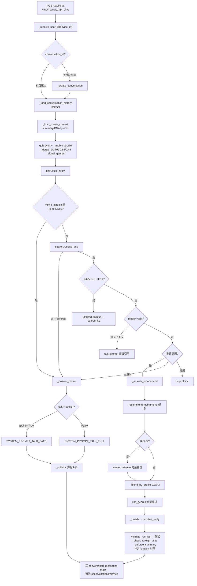

# C · AI 推荐链路与防幻觉审查

| 项 | 内容 |
|---|---|
| 审查日期 | 2026-08-21 |
| 仓库 | `I:\movie-yingling` |
| 项目 | 影灵 CINE |
| Agent ID | `8dfd0b67-e9ff-4bac-a2b4-a3fef3d3f47b` |
| 方式 | 只读多角度 Sub Agent 审查 |

> 本文由并行 Sub Agent 审查产出，未改动业务代码。

---
## 摘要

`/api/chat` 是一条「规则意图分流 → 规则/FTS/向量召回 →（可选）LLM 润色 → 编号/书名号校验与卡片对齐 → offline 回传」的落地链路，**推荐路径的库内约束相对扎实**；但**无剧透在事实注入上自相矛盾**、**标题解析优先于推荐意图易误路由**、**本仓库无向量 npz / 无 llm_config 时实质常离线**、**评测仅烟测**。文档（尤其 Quickstart「三/四阶段未实施」）已落后于代码。

---

## 推荐架构图（基于真实代码）

**模型链（`cine/llm.py`）**：`models.chat`（配置）→ `CHAT_MODELS=["deepseek-v4-flash","glm-5.2"]`，排除 `sensenova-6.7-flash-lite`；key 链：`CINE_LLM_API_KEY` → `llm_key.local.txt` → `llm_keys_backup.txt` → 配置内联；`MIN_INTERVAL=1.0`；额度/401 换 key；429 sleep 6s；**无熔断**。history 再截 `[-10:]`。

---

## 防幻觉机制有效性评估（强 / 中 / 弱 + 证据）

| 机制 | 评级 | 证据 |
|------|------|------|
| 推荐只出清单内片 | **强（推荐路径）** | `SYSTEM_PROMPT_REC` 硬约束；`_check_foreign_titles`；卡片按正文《片名》过滤；citation 按 `final_ids` 裁剪（`chat.py` `_answer_recommend`） |
| 编号校验 | **中** | `_validate_rec_ids`：无 `[推荐编号:]` 时直接 `return True`（宽松） |
| 事实来自 enriched | **中偏强** | `_movie_card` / FTS snip / `explain_card` 模板化；LLM 定位为润色 |
| 标题归一化 | **中** | `data.norm_title` + `resolve_title` 主名/包含匹配；短标题误命中风险 |
| citation 可追溯 | **中偏强** | quote/fts 带 `movie_id`+原文；但正文句子与 citation **无逐句对齐** |
| 无剧透 | **弱** | talk 仅换 `TALK_SAFE/FULL`；`_movie_card` / `_load_movie_context` **仍注入完整简介**；推荐路径 **无剧透约束、无后处理**；仅 citation 在 spoiler 时少挂 dn1 |
| 库外片 | **弱（电影问答）** | `resolve_title` 可走 ext，直接吐库外简介且 `offline: True`，无 LLM 闸门 |

**综合：推荐选片防幻觉 ≈ 中强；陪看/无剧透 ≈ 弱；全局 ≈ 中。**

---

## Critical / High / Medium / Low

### Critical
1. **无剧透名不副实（事实侧剧透）**  
   - **位置**：`chat._movie_card`、`main._load_movie_context`（注入 `summary`）、`_answer_movie` talk 分支仍把 `facts=_movie_card(m)` 交给模型。  
   - **影响**：UI「无剧透已开」时，模型仍可读到剧情简介，极易泄露情节。  
   - **修复**：spoiler=True 时从 prompt 去掉 summary/可剧透评论；仅留 DNA/口碑维度/非剧透短评；必要时后处理拦截结局类关键词。

2. **意图顺序：标题解析压过推荐**  
   - **位置**：`chat.build_reply`：`resolve_title` 在推荐意图之前。  
   - **影响**：「推荐类似《霸王别姬》」「有没有像千与千寻的」易进 `_answer_movie` 而非 `_answer_recommend`，推荐+排重+画像链路全跳过。  
   - **修复**：含「推荐/类似/像…一样」时优先推荐；或 resolve 仅在显式问答模板命中时生效。

### High
3. **本环境向量库缺失 → 语义召回空转**  
   - **位置**：`embed.VECTORS_PATH = data/enriched/movie_vectors.npz`；仓库内 **无任何 `.npz`**。  
   - **影响**：规则没命中时 `retrieve` 恒空，语义需求（「适合失恋后晚上看」）质量断崖。  
   - **修复**：赛前打包/生成 npz；启动健康检查暴露 `embed.available()`。

4. **`llm_config.json` / 本地 key 不在仓库**  
   - **位置**：`llm._cfg` → `data/task/llm_config.json`（当前不存在）。  
   - **影响**：无 env/本地 key 时 `chat_reply` 直接 `(None,None)`，全程规则离线；答辩需确认演示机密钥。  
   - **修复**：赛机用 env 注入；启动日志明确「LLM 不可用」。

5. **history 携带 `movie_ids` 原样进 OpenAI messages**  
   - **位置**：`main._load_conversation_history` 返回含 `movie_ids`；`llm.chat_reply` `messages += history[-10:]`。  
   - **影响**：部分 SDK/网关校验失败 → 误降级 offline，或脏字段进上下文。  
   - **修复**：送模前只保留 `role/content`。

### Medium
6. **`_validate_rec_ids` 宽松 + 无书名号片名漏检**  
   - **位置**：`_validate_rec_ids`、`_check_foreign_titles`（仅 `《》`）。  
   - **影响**：不写编号、或不加书名号的库外片名可漏网（依赖 prompt 自觉）。  
   - **修复**：无编号则强制离线或二次抽取片名白名单；扩展非书名号匹配。

7. **文档与实现漂移（误导答辩）**  
   - **位置**：`AI_CONTEXT_QUICKSTART.md` 称画像/排重未实施；实现已有 `_history_seen_ids`、隐式画像、`like_genres`。文档写历史 8 条，代码 load **24**、LLM **10**。  
   - **修复**：对齐文档或以代码为准口头说明。

8. **注册合并后 conversation_messages 不改归属、靠 conversations.user_id**  
   - **位置**：`api_register` 更新 `conversations`/`user_signals`/`user_personality`（有条件）。  
   - **影响**：设计可接受；若只迁 messages 不迁 conversations 会孤儿——当前迁了 conversations。**人格**：正式账号已有画像则丢弃游客画像（`DELETE` 游客行）。  
   - **修复**：冲突时合并 DNA 而非丢弃；双写校验。

9. **无熔断 / 长超时**  
   - **位置**：`llm.chat_reply` timeout=90，仅节流+换 key+换模型。  
   - **影响**：坏网关拖满 90s×模型×key，聊天体感卡死。  
   - **修复**：总预算 8–12s；连续失败短时熔断。

### Low
10. **`match` 分伪精度**（`_rec_card` 公式分）— 展示用，非检索分。  
11. **账号页 `chats` 全局历史**与会话隔离并存— 不串用户，但同用户跨会话在账号页混显。  
12. **`test_ai_context.py` 弱断言**— 见下节。

**隐私串话**：`_conversation_owned` + 非本人 history 空；越权 `404`。**同 device 注册合并后优先注册用户**（`ORDER BY (phone IS NOT NULL)`）。未发现 A 历史直接喂 B；风险主要在 **device_id 被伪造**（未鉴权 token 的聊天路径）。

---

## 推荐质量风险场景清单（用户怎么问会翻车）

| 用户问法 | 可能翻车点 |
|----------|------------|
| 「推荐类似《霸王别姬》的」 | 被 `resolve_title` 截走，变成讲霸王别姬 |
| 「适合失恋的雨夜看」 | 规则无命中 + 无向量 → 空/弱结果或 help |
| 「不要恐怖片，要温馨国产」 | `parse_hint` 难表达否定；可能仍出高节奏片 |
| 「换两部更短的」 | 排重依赖 `movie_ids`；旧会话无该字段则重复；片长约束靠 LLM 理解非硬过滤 |
| 「无剧透」下问结局/讲什么 | 简介已在 prompt，易剧透 |
| 「哪部提到陀螺」但无引号 | FTS 抽取弱 → 空搜 |
| 短片名包含匹配（2 字） | `resolve_title` 误绑错误电影 |
| 人格很偏视听但只说「推荐好看的」 | 规则池大，画像只 0.3 重排，个性化弱 |
| 注册前游客测人格，注册账号已有人格 | 游客人格被删，合并「失效」感 |
| 演示机无 key | 全文 offline 模板，理由变「清单堆砌」 |

---

## 赛前最小加固建议（≤1 天）

1. **无剧透**：spoiler 时从 `_movie_card` / movie_context **剥离 summary**（及明显剧情评论）；推荐 prompt 加一句「禁止剧情细节」。  
2. **意图门控**：`推荐|类似|像…` 优先 `_answer_recommend`，再 `resolve_title`。  
3. **送模 history 消毒**：去掉 `movie_ids`。  
4. **赛机资产**：确认 `movie_vectors.npz` + `CINE_LLM_API_KEY`；启动打印 `embed.available()` / LLM ready。  
5. **LLM 总超时**：例如 12s 上限，避免卡死。  
6. **加 5 个断言用例**：库外片名应降级；无剧透回复不含「结局/最后」类（抽检）；「类似 X」走 recommend；无 key 时 `offline=True`；越权 conversation_id → 404。

---

## 亮点（答辩可用）

1. **事实与生成解耦**：检索/规则出清单与引用，LLM 只润色；失败有模板降级，`offline` 前端可见（`Chat.tsx` model-tag）。  
2. **推荐后处理闭环**：编号校验→重试→书名号白名单→`_enforce_summary`→卡片与 citation 对齐，比「纯 prompt 防幻觉」可讲。  
3. **会话隔离 + 属主校验**：`conversations` / `conversation_messages`，防跨用户读历史。  
4. **双引擎召回设计**：规则 DNA 快路径 + 向量语义补位（有 npz 时）；排重 `_history_seen_ids`。  
5. **人格 × 行为**：quiz DNA + `_implicit_profile` + genre 微调 + `explain_card` 可解释推荐。  
6. **模型链与 key 轮换**：显式排除推理空 content 模型；配额失败换备用 key。

---

## Prompt 与评测缺口（`test_ai_context.py`）

**已覆盖（烟测，需服务在 8010）**  
- `test_conversation`：同 `conversation_id` 追问「为什么？」，软匹配是否提到相关片名  
- `test_movie_context`：带 `movie_id` 的 talk  
- `test_new_conversation`：不传 id 是否新开会话  

**明显缺失**  
- 防幻觉（库外片名、编号、卡片一致性）  
- 无剧透（prompt 输入是否含 synopsis、输出抽检）  
- offline / 无 key  
- 越权 conversation、注册合并人格/信号  
- 向量不可用降级、推荐意图 vs 标题误路由  
- 人格/隐式画像是否改变候选序  
- 无断言框架（print + 弱包含），非 CI 回归  

**文档对照**：`AI_CONTEXT_IMPLEMENTATION.md` / `PLATFORM_DOCUMENTATION.md` 描述的防幻觉与会话模型大体与代码一致；`AI_CONTEXT_QUICKSTART.md` 的「画像/排重未实施」**以代码为准应视为过时**。
